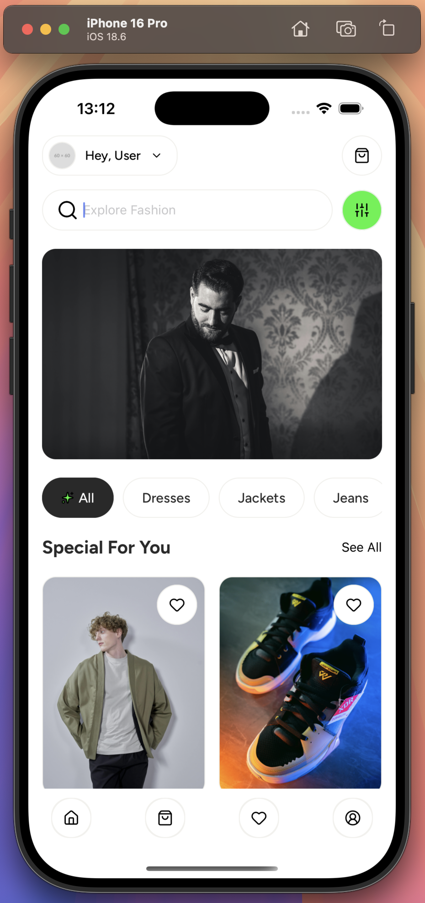
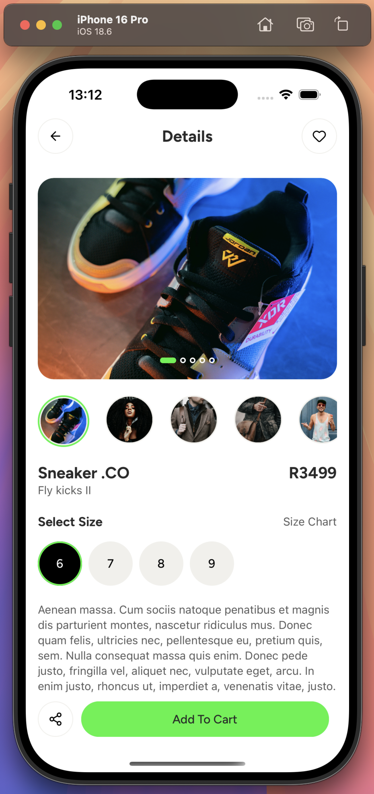

# Ecommerce Store

Shopping application built with react native CLI, redux toolkit for global state and graphQL for API layer.

## Running the application
Before attempting to run the application make sure your environment is setup for android and IOS development.
For more details about this setup visit: [React Native CLI Docs](https://reactnative.dev/docs/getting-started-without-a-framework)

- Run `yarn install` to install project dependencies
- Run `npx pod-install` to install IOS dependencies
- `npx react-native run-android` runs the android emulator
- `npx react-native run-ios` runs the IOS simulator

## Application screens:

